## Machine Learning - Practical Work 3
### Samuel Mayor, Alexandra Korukova

### SOM - Part 1  
#### Exercise 1 : Animals database clustering with Kohonen Self-Organizing Maps  

Below is the __U-matrix__ representing the result of the Kohonen Self-Organizing Maps algorithm:  
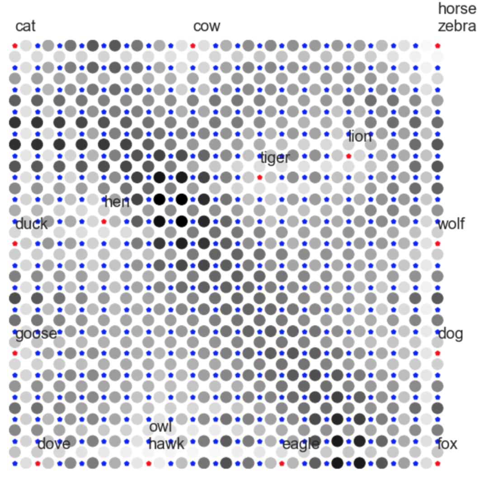


> Q: Analyze the code (in KohonenUtils.py) to understand what are the uses of each block in the cell right above.

```python
kmap = KohonenUtils.KohonenMap(20,
                               20,
                               size_vector=len(animals.columns))
```
Creates a Kohonen Map of size 20x20 and input vector of the length of the features set (13 in our case).

```python
learning_rate = KohonenUtils.ExponentialTimeseries(1, 0.2, n_iter * len(animals.index))
neighborhood_size = KohonenUtils.ExponentialTimeseries(4./3 * len(animals.index), 1, n_iter * len(animals.index))
```  
The code below initializes the __learning rate__ and the __neighbourhood size__ of the algorithm.  

```python
kmap.train(animals.values, np.array(animals.index), n_iter, learning_rate, neighborhood_size)
```  
This function launches the training algorithm for the clustering.
It consists in (briefly):
1. Picking the random input (features that correspond to one animal)
2. Finding the closest (__winner__) neuron to this input (in Euclidian distance metric, compares the input vector with the weight vector of every neuron)
3. Update the weights of the neurons in the __neighborhood__ of the winner neuron
4. Repeat steps 1, 2, 3 for all inputs in the random order
All the steps above are repeated __n_iter__ (numer of iterations) time.

> Q: What do you think about the clustering quality ?  

The quality of the clustering is good. All the __small__ animals are put to the left, __medium__ ones are in the bottom left corner and the __big__ ones take the upper right corner. __Two-legged__ animals and animals having __feathers__ are in the bottom left part of the matrix and __four-legged__ ones along with those having hair are in the upper right part. Animals having __mane__ take the upper right corner of the matrix. Birds able to __fly__ are in the bottom right corner. __Swimming birds__ are next to each other in the middle of the left side of the matrix. Animals having __hooves__ are on the upper side.  
Furthermore, these results are intuitively correct: birds, big cats, dogs, big herbivores are each grouped together in the matrix.

> Q: We plotted the U-Matrix in the previous cell. What does it represent ?  

The __U-matrix__ is the result of the SOM algorithm. It shows the clusters and the outputs (animals) placed in the clusters.  

> Q: What do the small stars represent ? What do the bigger circles represent ?  

The __small stars__ represent the __neurons__ of the Self-Organizing Map.  
The __bigger circles__ represent the __distance__ between the clusters of the matrix.

> Q: What does the color in the big circles mean ?  

The color in the big circles represents values of the distance between the clusters. Darker the color is, bigger is the distance.

> Q: What does the color in the small stars mean ?  

__Red__ stars are the __outputs__ (animals' labels) of the system. They are actually the final winner neurons of the trained matrix. These winner neurons have the closest weight vectors to the input vectors. Input vectors are the lines of the input matrix (13 features corresponding to one animal). The __blue__ stars represent all other neurons.   

> Q: Plot the learning rate and the neighborhood size. Why do you think we choose them like this?   

__Learning rate__ is the Exponential Time Series shown below:
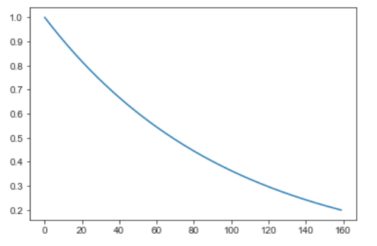  

__Neighborhood size__ is the Exponential Time Series shown below:  
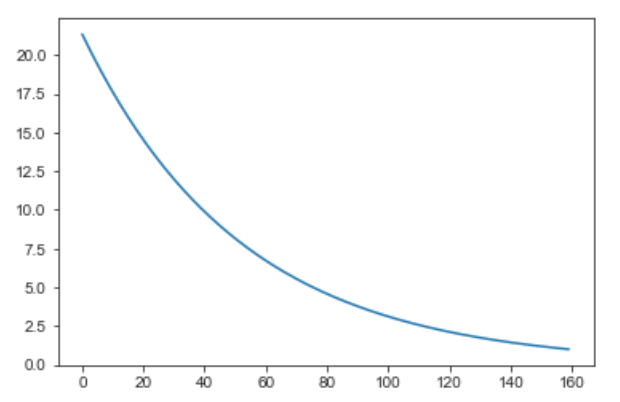  

These two functions are Exponential Time Series. These are decreasing over time (iterations) exponential functions.

`At the beginning when the neighborhood is broad, the self-organizing takes place on the global scale. When the neighborhood has shrunk to just a couple of neurons, the weights are converging to local estimates.`  
https://en.wikipedia.org/wiki/Self-organizing_map  
This is why these functions are decreasing.

#### Exercise 2 : Animals database clustering with K-Means  

> Q: Observe the animals that are grouped together by K-Means and try different numbers of clusters: K=2,3,4, etc.  

While the number of clusters *K* remains small regard to the number of outputs (animals), the quality of the clustering is pretty good. Only some punctual outputs seem to belong to an inadequate cluster.  When *K* approaches the number of outputs, the quality of the clustering decreases: clusters containing a single or even empty clusters appear.  
But the results obtained with the number of iterations equal to 1 are not stable: they may change a lot with every execution of the clustering algorithm.

> Q: n_init is a parameter that automatically asks K-means to try different cluster initializations and selects the best result. init='random' asks K-means to randomly initialize the cluster centroids. Please, try init=’k-means++’ and modify n_init to 10 for example and observe the results.  

The quality of the clustering increased, due to the smart centroids initialization (`k-means++`) and the higher number of iterations.  

### SOM - Part 2
#### Exercise 3: Self-organized representation of a collection of images  

> 1. Explain the three different methods we provided for extracting features. What do you understand about them (input, output), how do they work ?  

__Method 1__  
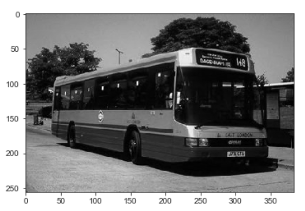  

`extract_histogram()` function from `WangImageUtilities.py` converts each extracted image to the grayscale and then constructs the corresponding histogram. Every histogram represents the repartition of the greyscale of pixels of the given image. The greyscales are not the same for all images, but defined from minimum to maximum scale for each image. These histograms are then passed as input data to the SOM clustering algorithm. Hence, the __feature__ in this method is actually a number of pixels of one among ten greyscales. In other words, the __input vectors__ to which the __weight vectors__ of the SOM will tend are these grayscale vectors of size 10.  

__Method 2__  
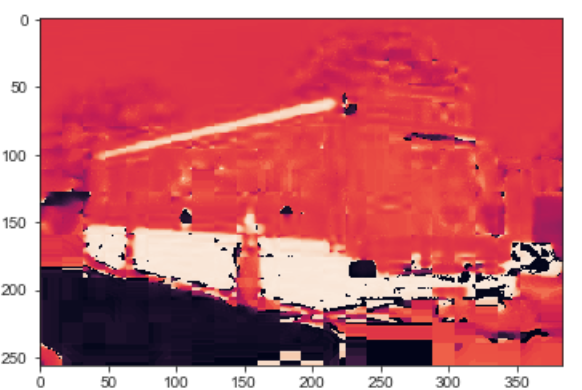  

In this method, the image is fist converted to the HSV (hue, saturation, value) format. Only the values from the first "hue" channel are taken to construct a histogram. As in the previous method, 10 hue scales are used to calculate the number of the pixels belonging to one of these scales. Therefore, the __feature__ for the clustering algorithm is the number of pixels of a given hue scale in this method. Just like in the previous method, the scales are not globally defined for all the images, but vary from the minimum to maximum hue scale for every image.

__Method 3__  

| Red channel | Green channel | Blue channel |  
|:-----------:|:-------------:|:------------:|  
| 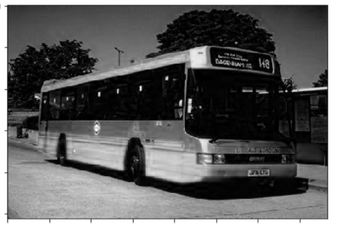 | 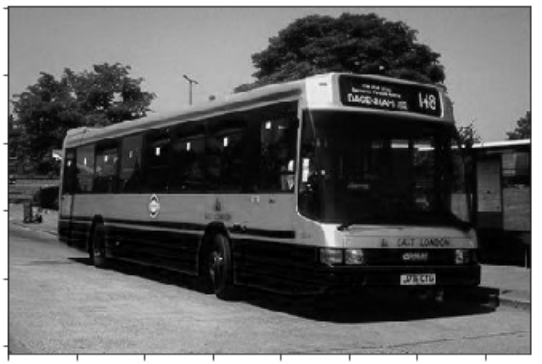 | 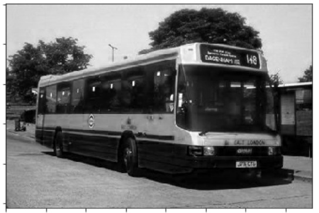 |

This time we manipulate the colors of the pixels in the images: the Red, Green and Blue component of every pixel. The histogram of every image contains 3 sets of scales: 10 red scales, 10 green and 10 blue ones. Every scale set in the resulting histogram  contains the number of pixels of the image belonging to one among 10 scales of the given color.

> 2. Try the SOM with several (minimum 3) different sets of images (always 100 images per class and at least two classes). You can change the size of the Self-Organizing Map as well as its parameters.  

Extracted sets of images:
* beaches  
* dinosaurs  
* roses

We would like SOM to create 3 well-defined clusters for each set of images.  
Below are the results of the 3 provided methods:  

| Grayscale image | H-channel from HSV image | R,G,B channels from RGB image |  
|:---------------:|:------------------------:|:-----------------------------:|  
| 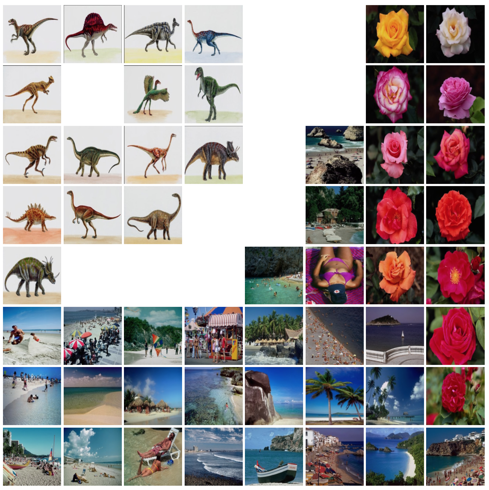 | 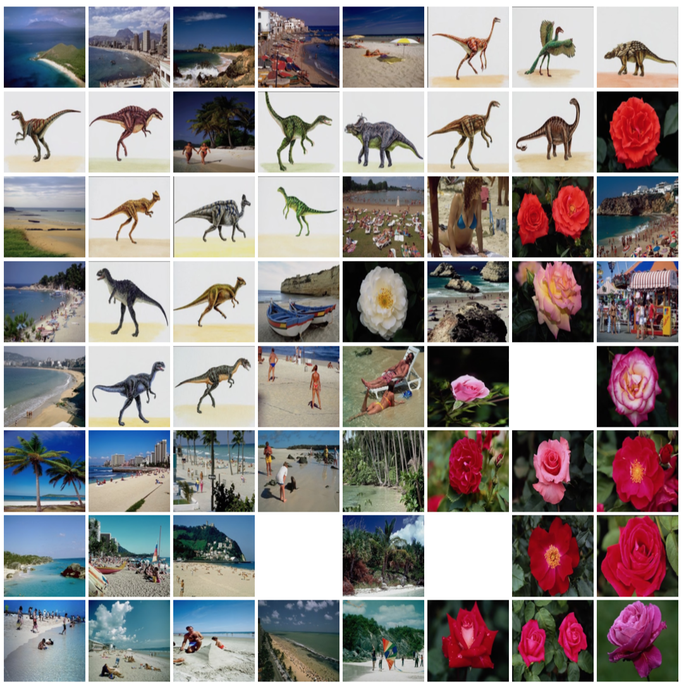 | 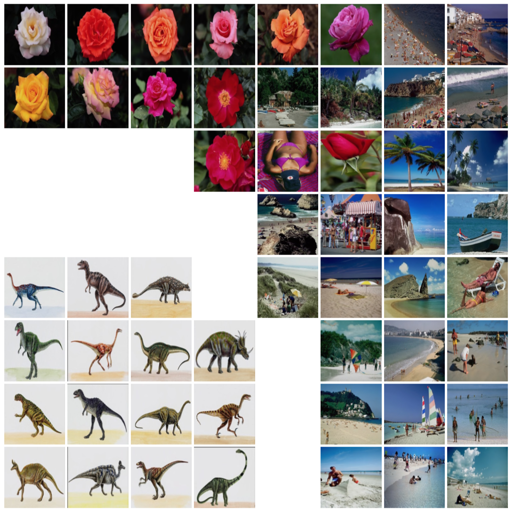 |  

First (grayscale) and third (RGB) methods give the good results, but the second (HSV) method does not perform well on our sets of images.  

The best results are obtained with RGB clustering, since the subsets we used differ a lot in color: for example, most of beach pictures contain a lot of blue, roses are surrounded with green leaves and the dinosaurs are painted on the similar background. All these traits allow the SOM algorithms to find the well-defined patterns for the clustering based on the quantity of the different red, green and blue scales.  

First, we noticed that one picture is misclassified by both grayscale and RGB SOMs (3d row 5th column of the rightmost map). This is not surprising, because the clustering patterns are based on the quantity of the certain scale of the color. They ignore the shape and the position of the colors in the image.  

The second remarkable aspect of the grayscale and RGB U-matrices is that the both models classify the dinosaurs images better than another image sets. As we can see, the dinosaurs' images look much more similar with each other than the pictures from another groups, so this is a consistent result.
